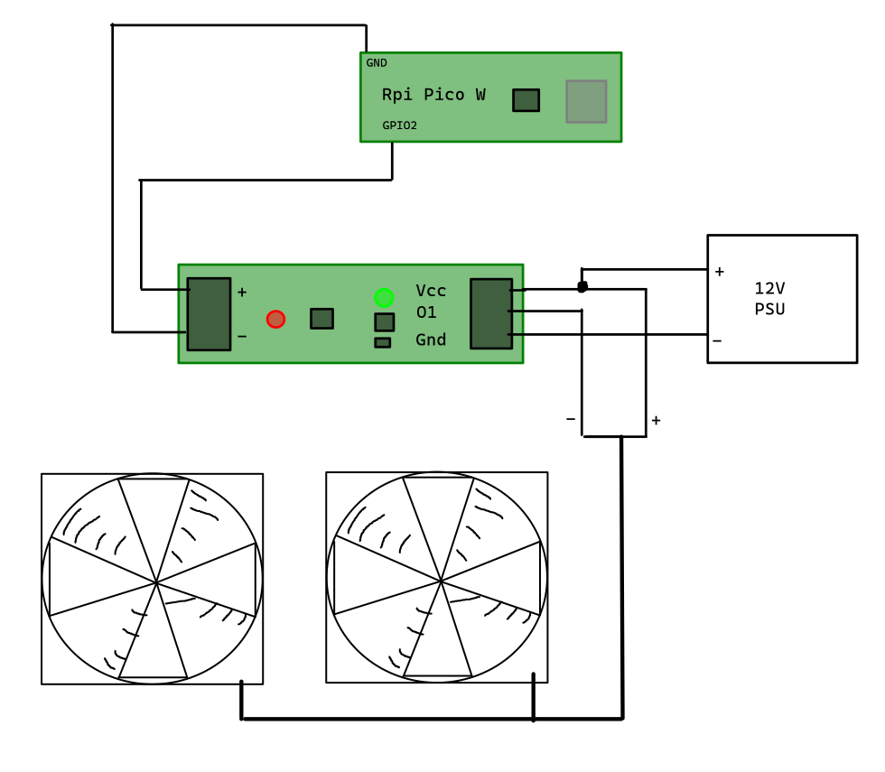
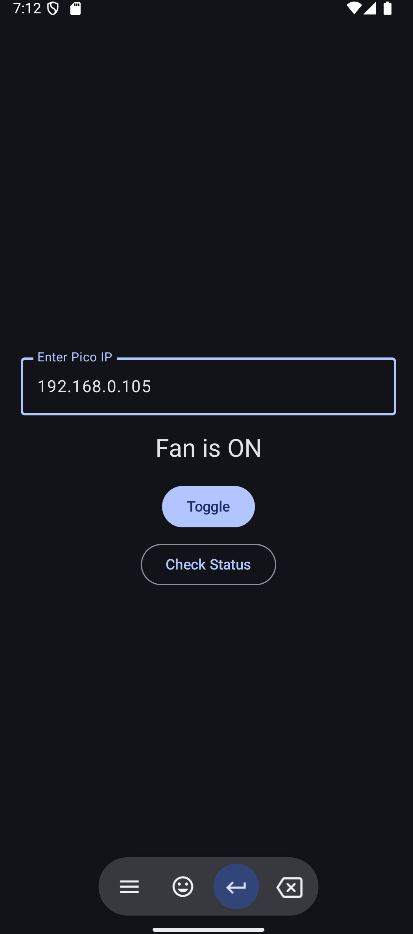

# Android MOSFET controller with Raspberry Pi Pico

## Content

- **main.py** - Python script to be uploaded to Raspberry Pi Pico
- **PicoSwitcher/** - Kotlin application for Android for remote control

Before running the application, enter actual Wi-Fi SSID and password in `main.py`.
You might also enter default value for device IP address in the Android app (`PicoSwitcher/app/src/main/java/com/example/picoswitcher/MainActivity.kt`)

## Hardware

- Raspberry Pico W
- SV-5A1R1P-N - like [this](https://www.mantech.co.za/ProductInfo.aspx?Item=15M8057)
- 12V power supply
- 2x 12V PC fan

